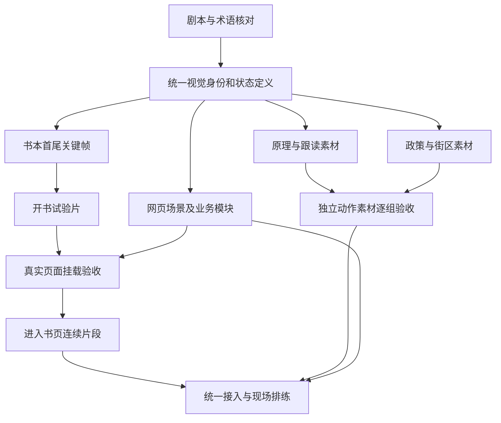

# 并行制作依赖

用户已授权子智能体并行。按实际依赖拆分任务，每组由一个负责人编辑，完成后由主代理汇总检查。

```mermaid
flowchart TD
  A[剧本与术语核对] --> B[统一视觉身份和状态定义]
  B --> C[书本首尾关键帧]
  B --> D[原理与跟读素材]
  B --> E[政策与街区素材]
  B --> F[网页场景及业务模块]
  C --> G[开书试验片]
  G --> H[真实页面挂载验收]
  H --> I[进入书页连续片段]
  D --> J[独立动作素材逐组验收]
  E --> J
  F --> H
  I --> K[统一接入与现场排练]
  J --> K
  F --> K
```

同一连续镜头的下一段必须依赖上一段合格的实际尾帧。不同素材组可以并行；原理标签、人数和模拟结果在汇总时统一核对。媒体动作和服务请求有各自的取消与恢复机制。

本轮已执行的并行任务：架构与素材约束同步、剧本方法审阅、图像修订与服务预检。网页与视频生产节点仍为后续制作计划。
